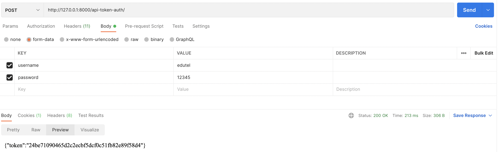
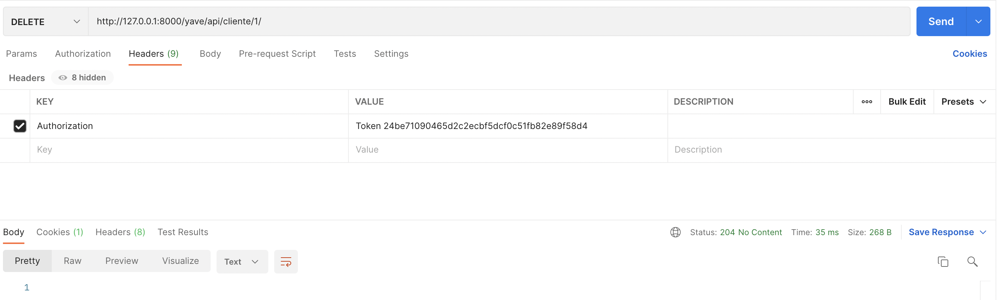

Django Admin
usuario: eduardo_jonathan@outlook.com
contraseña: 12345

documentacion: active el admindocs de Django 

## login

## get Clientes status 200

## delete Clientes status 204

## filtero eliminado True (mostrar eliminados)

## ejecutar pruebas unitarias (se puede automatizar con git hook o con jenkins):
1. python manage.py test (se ejecutara el archivo task/tests.py) la pruebas unitarias estan echas segun el estandar de Django Rest Framework (ahi es donde y como se deberian llenar los datos del api segun Django)